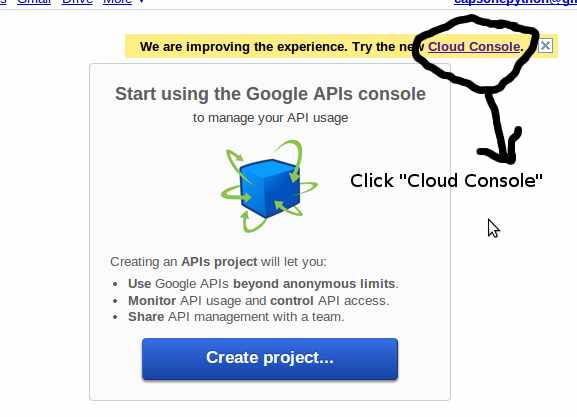
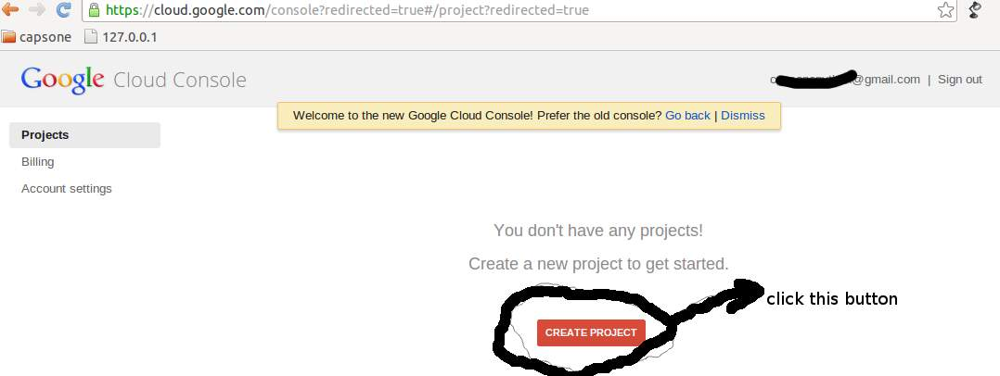
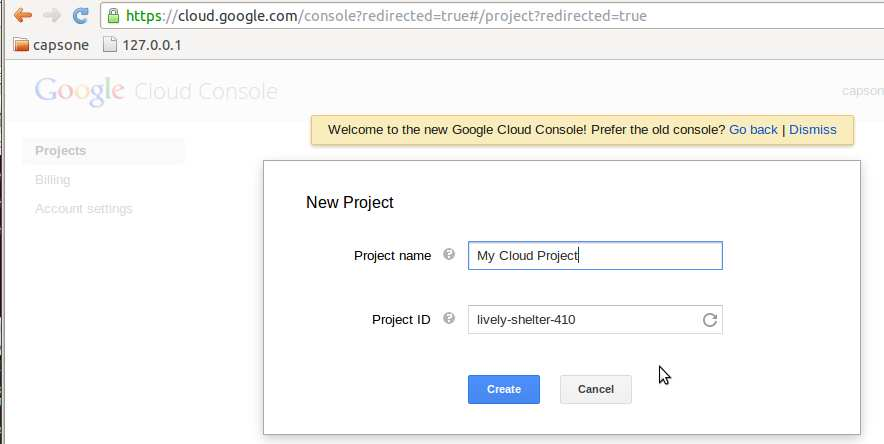
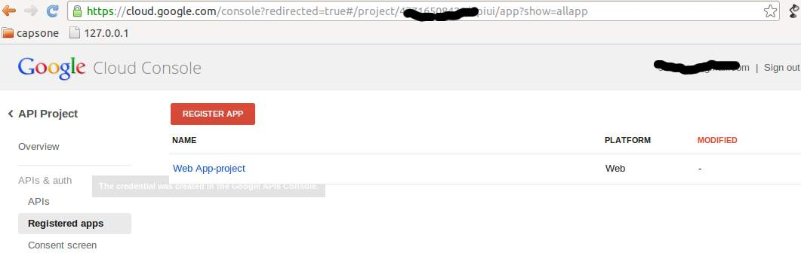
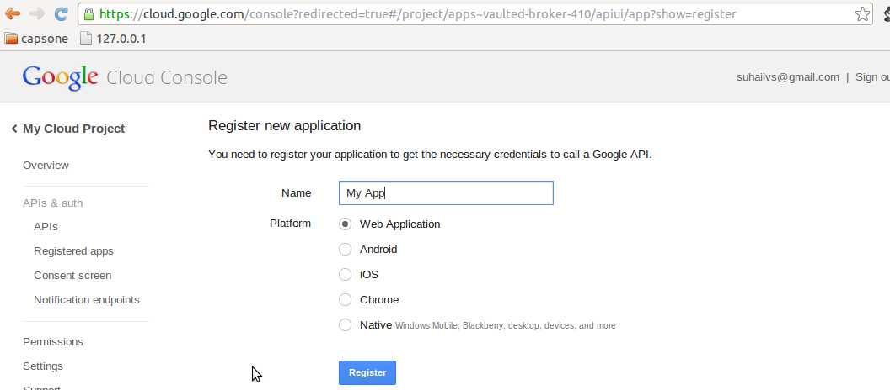
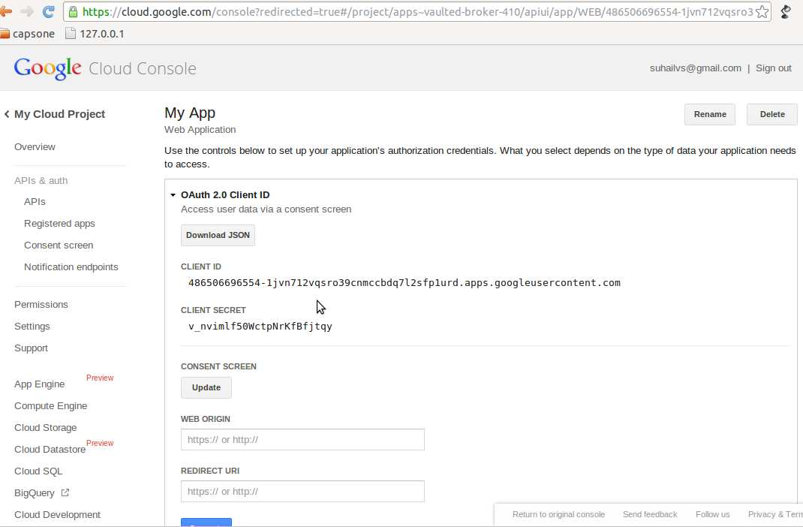

Google
======

This section describes how to setup the different services provided by
Google.

Google OAuth
------------

Google provides ``Consumer Key`` and ``Consumer Secret`` keys to registered
applications, but also allows unregistered application to use their authorization
system with, but beware that this method will display a security banner to the
user telling that the application is not trusted.

Check `Google OAuth`_ and make your choice.

- fill ``Consumer Key`` and ``Consumer Secret`` values::

      GOOGLE_CONSUMER_KEY
      GOOGLE_CONSUMER_SECRET

anonymous values will be used if not configured as described in their
`OAuth reference`_

- configure the display name to be used in the *grant permissions* dialog
  that Google will display to users in::

      GOOGLE_DISPLAY_NAME = ''

  shows 'Social Auth' by default, but that might not suite your application.

- setup any needed extra scope in::

      GOOGLE_OAUTH_EXTRA_SCOPE = [...]

- Supply a list of Google Apps account domain strings to be checked. The default (empty list) allows all domains.  If a list is provided and a user attempts to sign in with a Google account that is not in the list, then a ValueError will be raised and the user will be redirected to your login error page::

    GOOGLE_WHITE_LISTED_DOMAINS = ['mygoogleappsdomain.com']

- Supply a list of Google Apps or Gmail email strings to be checked::

    GOOGLE_WHITE_LISTED_EMAILS = ['me@mygoogleappsdomain.com', 'you@gmail.com']

Check which applications can be included in their `Google Data Protocol Directory`_

Google OAuth2
-------------

Recently Google launched OAuth2 support following the definition at `OAuth2 draft`.
It works in a similar way to plain OAuth mechanism, but developers **must** register
an application and apply for a set of keys. 

The steps below will get **Client ID** and **Client Secret**.

- Register a new application at `Google Developer Console`_, you need to login using your gmail username and password. The link `Google Developer Console`_, will redirect to any of the below screens.  

   Figure 1. Google Old Website.

   Figure 2. Google new Cloud Console.

- if you redirect to Google Old Website(see Figure 1), click **Cloud Console** link.

- now click **Create Project** Button(see Figure 2).

- now Give a **Project Name** and click **Create** (see Figure 3).

   Figure 3. Create New Project.

- your project is created. Navigate to **APIs & atuh** -> **Registered apps** (see Figure 4).

   Figure 4. Register App.

- Gave a **Name** to your App. Select **Web Application** Option box (see Figure 5).

   Figure 5. Register New App.

- That is it Your application is created. You need to provide site url(see Figure 6), then click **Update Button**.

   Figure 6. Client Keys.

Further documentation
can be found at `Google OAuth2`_.

**Note**:
  This support is experimental as Google implementation may change and OAuth2 is still
  a draft.

To enable OAuth2 support:

- fill ``Client ID`` and ``Client Secret`` settings, these values can be obtained
  easily as described on `OAuth2 Registering`_ doc::

      GOOGLE_OAUTH2_CLIENT_ID = ''
      GOOGLE_OAUTH2_CLIENT_SECRET = ''

  previous name ``GOOGLE_OAUTH2_CLIENT_KEY`` is supported for backward
  compatibility.

- scopes are shared between OAuth mechanisms::

      GOOGLE_OAUTH_EXTRA_SCOPE = [...]

- optional support for static and unique Google Profile ID identifiers instead of
  using the e-mail address for account association can be enabled with::

      GOOGLE_OAUTH2_USE_UNIQUE_USER_ID = True

Check which applications can be included in their `Google Data Protocol Directory`_

Google OAut2 Offline Mode
-------------------------

This setting is needed in order to get a refresh token from while using Google
OAut2 backend::

    GOOGLE_OAUTH2_AUTH_EXTRA_ARGUMENTS = {'access_type': 'offline'}

This will add a ``refresh_token`` entry in the ``UserSocialAuth.extra_data``
attribute of the related association. With this token it's possible to refresh
the ``access_token`` at any time by calling::

    user_social_auth.refresh_token()

You can get the ``user_social_auth`` instance with a code similar to this::

    user = User.objects.get(pk=...)
    user_social_auth = user.social_auth.get(provider="google-oauth2")

Google OpenID
-------------

Configurable settings:

- Supply a list of Google Apps account domain strings to be checked::

    GOOGLE_WHITE_LISTED_DOMAINS = ['mygoogleappsdomain.com']

- Supply a list of Google Apps or Gmail email strings to be checked::

    GOOGLE_WHITE_LISTED_EMAILS = ['me@mygoogleappsdomain.com', 'you@gmail.com']

Orkut
-----

Orkut offers per application keys named ``Consumer Key`` and ``Consumer Secret``.
To enable Orkut these two keys are needed.

Check `Google support`_ and `Orkut API`_ for details on getting
your consumer_key and consumer_secret keys.

- fill ``Consumer Key`` and ``Consumer Secret`` values::

      ORKUT_CONSUMER_KEY
      ORKUT_CONSUMER_SECRET

- add any needed extra data to::

      ORKUT_EXTRA_DATA = ''

- configure extra scopes in::

      ORKUT_EXTRA_SCOPES = [...]

.. _Google support: http://www.google.com/support/a/bin/answer.py?hl=en&answer=162105
.. _Orkut API:  http://code.google.com/apis/orkut/docs/rest/developers_guide_protocol.html#Authenticating
.. _Google OpenID: http://code.google.com/apis/accounts/docs/OpenID.html
.. _Google OAuth: http://code.google.com/apis/accounts/docs/OAuth.html
.. _Google OAuth2: https://developers.google.com/accounts/docs/OAuth2Login
.. _Google Developer Console: https://code.google.com/apis/console
.. _OAuth2 Registering: http://code.google.com/apis/accounts/docs/OAuth2.html#Registering
.. _Google Data Protocol Directory: http://code.google.com/apis/gdata/docs/directory.html
.. _OAuth2 draft: http://tools.ietf.org/html/draft-ietf-oauth-v2-10
.. _OAuth reference: http://code.google.com/apis/accounts/docs/OAuth_ref.html#SigningOAuth
.. _Orkut OAuth:  http://code.google.com/apis/orkut/docs/rest/developers_guide_protocol.html#Authenticating
